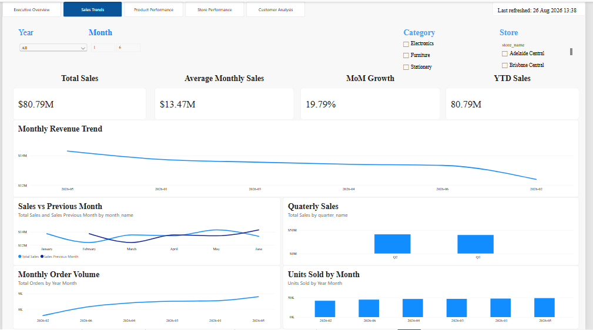
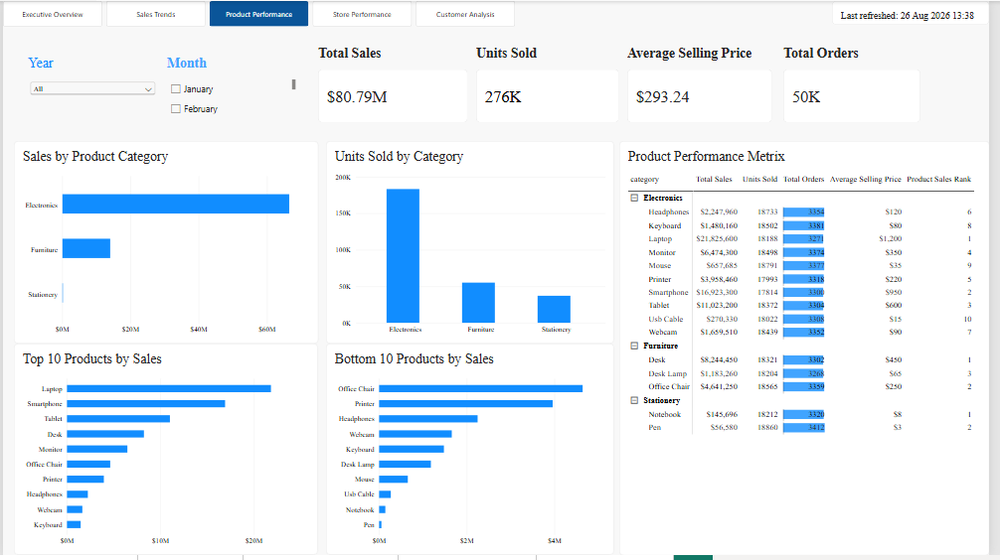
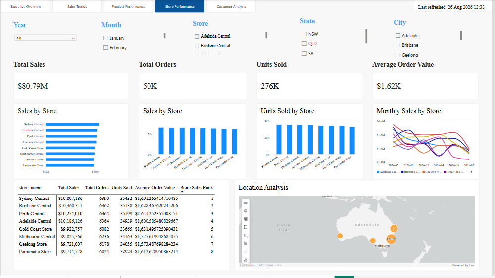
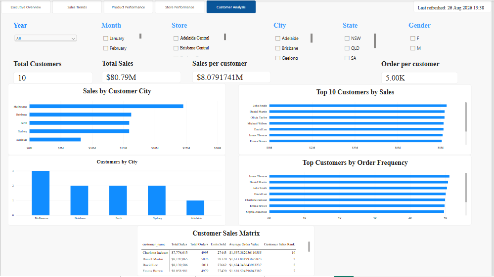

# Azure Retail Sales Data Engineering Project

End-to-end retail sales data engineering and analytics solution built using:

- Azure Data Lake Storage Gen2
- Azure Data Factory
- Azure Databricks
- Delta Lake
- PySpark
- Azure SQL
- Power BI
- DAX
- Git/GitHub

## Project Objective

Build an end-to-end retail analytics platform capable of ingesting,
transforming, modelling and visualising retail sales data.

## Architecture

Raw CSV
→ ADLS Gen2
→ Azure Data Factory
→ Bronze
→ Silver
→ Gold
→ Power BI

## Source Datasets

- Customers
- Products
- Stores
- Sales

## Data Engineering Layers

### Bronze

Raw ingestion with metadata.

### Silver

Data cleansing including:

- duplicate removal
- null handling
- datatype conversion
- string standardisation
- date standardisation
- sales validation

### Gold

Star schema:

- FactSales
- DimCustomer
- DimProduct
- DimStore
- DimDate

## Azure Data Factory

ADF orchestrates source ingestion and supports parameterised pipeline execution.

Key pipelines:

- PL_Load_Retail_Data
- PL_Generic_Load

The solution also implements pipeline audit logging and failure handling.

## Power BI Dashboard

Five report pages:

1. Executive Overview
2. Sales Trends
3. Product Performance
4. Store Performance
5. Customer Analysis

## Executive Overview

## Sales Trends

## Product Performance

## Store Performance

## Customer Analysis

## Project Highlights

- Designed end-to-end Azure-based retail data pipeline
- Implemented Bronze, Silver and Gold Medallion architecture
- Created reusable parameterised Azure Data Factory pipeline
- Implemented pipeline audit logging and failure handling
- Used PySpark for scalable data cleansing and transformation
- Designed Gold-layer dimensional/star schema
- Implemented FactSales and supporting dimensions
- Built DAX measures for sales, customer and product analytics
- Created five-page interactive Power BI dashboard
- Validated Power BI KPIs against Gold-layer SQL aggregations

## Technical Challenges & Resolutions

### ADLS Gen2 Access

Encountered Forbidden errors while importing schema.

Resolution:
- reviewed managed identity permissions
- validated Storage Blob Data Contributor access
- verified storage network configuration

### Duplicate Primary Keys

ADF pipeline reruns produced duplicate primary-key failures.

Resolution:
- identified non-idempotent loading behaviour
- reviewed load strategy and duplicate handling

### Pipeline Audit Procedure

Pipeline audit execution initially failed due to missing procedure parameters.

Resolution:
- aligned stored procedure parameters with ADF activity mappings

### Power BI Date Analysis

Month names were initially displayed out of chronological order.

Resolution:
- sorted month_name by numeric month
- created Year Month and YearMonthSort columns

### YoY Analysis

The sample fact data covers Jan-Jun 2026 only.

Resolution:
- avoided misleading YoY reporting
- used Average Monthly Sales and Month-over-Month analysis instead

## Skills Demonstrated

### Azure
- Azure Data Factory
- ADLS Gen2
- Azure SQL
- Azure Databricks

### Data Engineering
- ETL/ELT
- Medallion architecture
- Data quality
- Delta Lake
- PySpark
- Star schema modelling
- Pipeline parameterisation
- Audit logging
- Error handling

### Analytics
- Power BI
- DAX
- Dimensional modelling
- KPI design
- Data validation

### DevOps
- Git
- GitHub
- Version control
