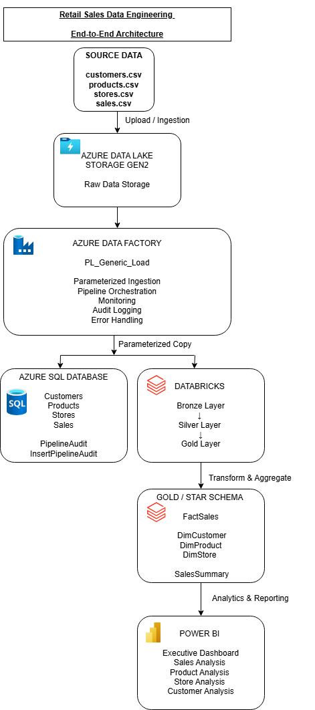
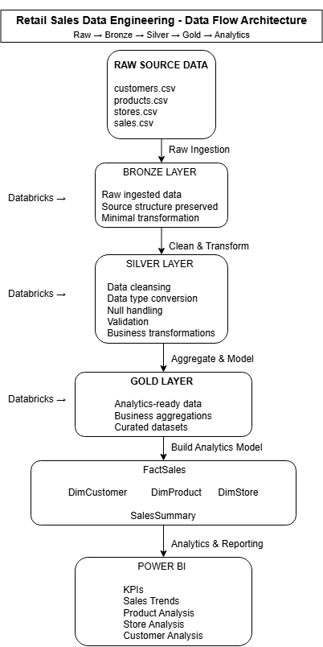

# Retail Sales Data Engineering - Architecture

This folder contains architecture diagrams for the Retail Sales Data Engineering project.

The solution demonstrates an end-to-end Azure data engineering workflow covering data ingestion, storage, transformation, analytics-ready data modelling, orchestration, monitoring, and reporting.

## Architecture Diagrams

### 1. End-to-End Architecture

**File:** `01_end_to_end_architecture.png`

Shows the complete data platform architecture from source files through ingestion, transformation, storage, and reporting.

The architecture includes:

- CSV source files
- Azure Data Lake Storage Gen2
- Azure Data Factory
- Azure SQL Database
- Databricks
- Bronze, Silver, and Gold data layers
- Star schema
- Power BI



---

### 2. Data Flow Architecture

**File:** `02_data_flow_architecture.png`

Shows how retail data moves through the data engineering solution.

The data flow follows the Medallion Architecture pattern:

```text
Raw Data
   ↓
Bronze Layer
   ↓
Silver Layer
   ↓
Gold Layer
   ↓
Star Schema
   ↓
Power BI
```

The Bronze layer stores ingested data, the Silver layer contains cleaned and transformed data, and the Gold layer provides analytics-ready fact, dimension, and aggregated datasets.



## Key Architecture Components

### Azure Data Lake Storage Gen2

Stores the raw retail source files and provides cloud storage for the data engineering solution.

### Azure Data Factory

Orchestrates data ingestion and movement using reusable parameterized pipelines.

The pipeline implementation also includes:

- Dynamic source and destination parameters
- Success and failure dependencies
- Pipeline monitoring
- Stored procedure based audit logging

### Azure SQL Database

Provides relational storage for structured retail data and stores pipeline audit information.

### Databricks

Performs data engineering and transformation across Bronze, Silver, and Gold layers.

### Gold Layer

Provides analytics-ready datasets including:

- FactSales
- DimCustomer
- DimProduct
- DimStore
- SalesSummary

### Power BI

Consumes curated data to provide business intelligence dashboards and retail sales analysis.

## Architecture Pattern

The project demonstrates:

- Cloud-based data ingestion
- Parameterized ETL/ELT pipelines
- Medallion Architecture
- Data transformation
- Star schema modelling
- Audit logging
- Error handling
- Analytics-ready data preparation
- Business intelligence reporting


